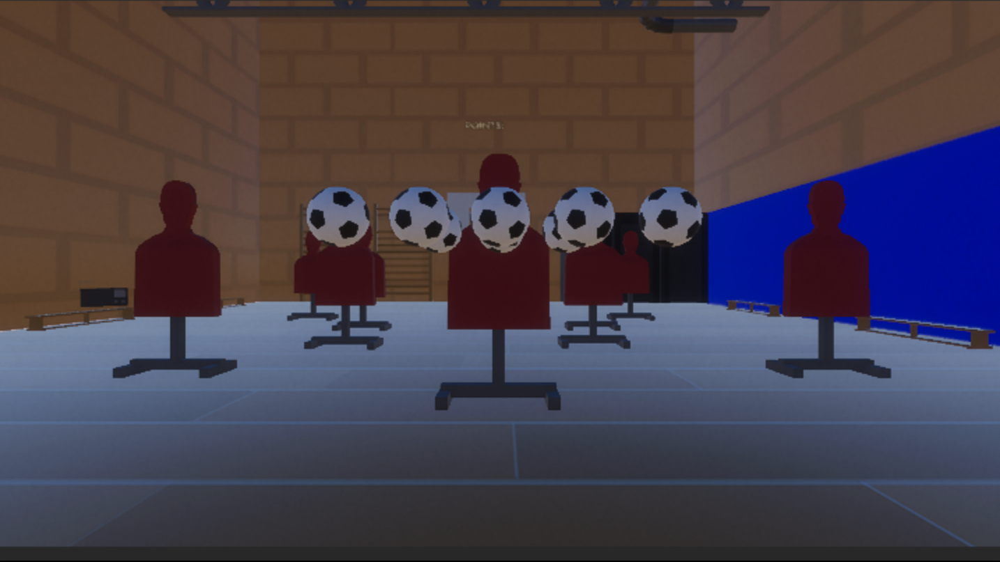
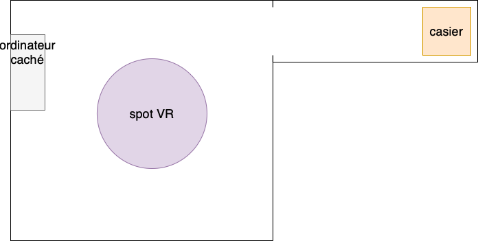
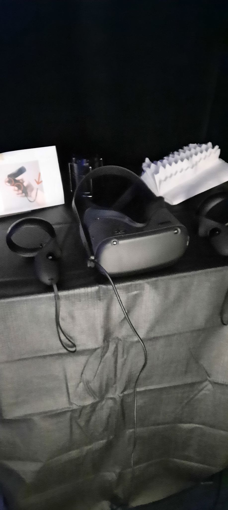
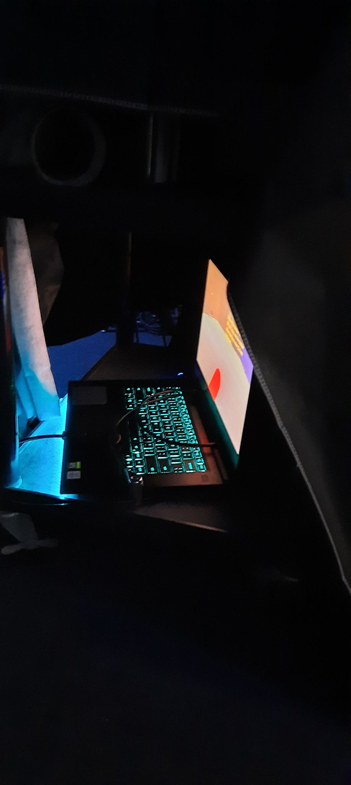
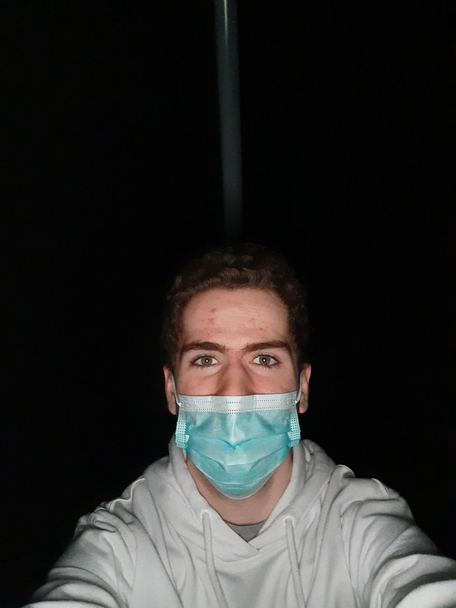

## Titre de l'oeuvre ou de la réalisation
3 minutes.

## Nom de l'artiste ou de la firme
Naoufal Bensaiad, Jérémie Lévesque et Samuel Poulin.
## Année de réalisation
L'oeuvre a été réalisée en 2022.
## Nom de l'exposition ou de l'événement
Les projets finaux des finissants de TIM 2022.
## Lieu de mise en exposition
Dans le grand studio au collège Montmorency.
## Date de votre visite
le 23 mars 2022
## Description de l'oeuvre

3 minutes est une oeuvre en réalité virtuelle qui dénonce comment l'intimidation est un sujet important en nous mettant à la place d'une personne qui est enfermée dans un casier. Au début, nous jouons avec des ballons et essayons de faire des buts. Ensuite, après une minute, on reste enfermé dans un casier tout en entendant les bruits du gymnase. 

## Explications sur la mise en espace de l'oeuvre ou du dispositif
L'oeuvre se situe dans un le coin d'une salle avec un couloir qui mène au casier dans le noir 

## Liste des composantes et techniques de l'oeuvre ou du dispositif
On a besoin des fichiers qui contiennent tous les informations sur réalité virtuelle ainsi que leurs sons.
## Liste des éléments nécessaires pour la mise en exposition
Pour la mise en exposition, il faut avoir un casque vr. Ensuite, il faut avoir un ordinateur pour que brancher le casque dessus. Il faut aussi avoir un casier avec des capteur a l'interieur et des speakers pour le son.

## Description de mon expérience de l'oeuvre
pour expérimenter cette oeuvre il faut se plonger dans le monde de la réalité virtuelle, ce qui t'émerge dans le monde en 360 degrés. Ensuite, vous êtes enfermé dans la noirceur d'un cashier ce qui vous plonge dans l'oeuvre avec le son de tous les cotes.

!ream_bleu_loin](Media/photos/dream_bleu_loin.jpg)

## Ce qui m'a plu, qui m'a donné des idées (justifications)
J'ai vraiment aimé la realite virtuelle, car je me sentais vraiment a l'interieur de l'oeuvre. J'étais aussi perturbe par l'effet de tristesse que le cashier pouvais amener avec la noirceur et les effet de son autour, mais cela rendait l'oeuvre encore meilleur.

## Aspect que je ne souhaiterais pas retenir pour mes créations ou que je ferais autrement (justifications)
Au moment où nous étions dans le cashier, nous ne savions pas s'il fallait sortir par nous-mêmes ou attendre étant donné qu'il n'y avait pas de chronomètre et cela amenait de la confusion. J'aurais mis un panneau qui dit que cela dure 5 min. Dans mes prochains projets, je vais penser à la confusion que certain aspect pourrait amener.
## Références

https://tim-montmorency.com/2022/projets/3-minutes/docs/web/index.html

