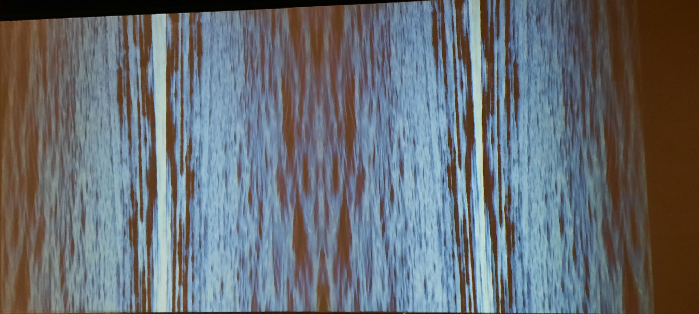

## Titre de l'oeuvre ou de la réalisation
### Le fleuve, 50° 11'52,8" N., 66° 4'10"O.

## Nom de l'artiste ou de la firme
### Catherine Béchard et Sabin Hudon.
## Année de réalisation
### L'oeuvre a été réalisée en 2021.
## Nom de l'exposition ou de l'événement
### Configuration du sensible.
## Lieu de mise en exposition
### Maisondes arts de Laval
## Date de votre visite
### Le 17 mars 2022.
## Description de l'oeuvre
### Le fleuve prend une vidéo du fleuve, la met à la verticale et les multiplie pour en avoir quatres.
## Explications sur la mise en espace de l'oeuvre ou du dispositif 
### L'oeuvre se situe dans un gros couloir et est affichée sur un mur.
## Liste des composantes et techniques de l'oeuvre ou du dispositif
### Le ficher avec la vidéo de l'oeuvre.
## Liste des éléments nécessaires pour la mise en exposition
### Un projecteur avec potentiellement des caches fils au cas où les fils vont sur le sol.
## Description de mon expérience de l'oeuvre
### Je me suis vraiment senti hypnotisé, car nous ne sommes pas habituer de voir le courant à la verticale. Je ne pouvais pas détourner mon regard et je me suis coucher ### pour pouvoir profiter de l'oeuvre en étant confortable.
## Ce qui m'a plu, qui m'a donné des idées (justifications)
### J'ai aimé le fait que j'étais hyptotisé et j'aimais tourner ma tête pour faire la transition entre la vrai image et l'oeuvre. Cela me donne l'inspiration que je peux ### déformer des images pour en faire des effets spectaculaire
## Aspect que je ne souhaiterais pas retenir pour mes créations ou que je ferais autrement (justifications)
### Mettre des sièges pour pouvoir s'asseoir, car si on regarde une oeuvre longtemps, il serait encore mieux de pouvoir être confortable.
## Références

