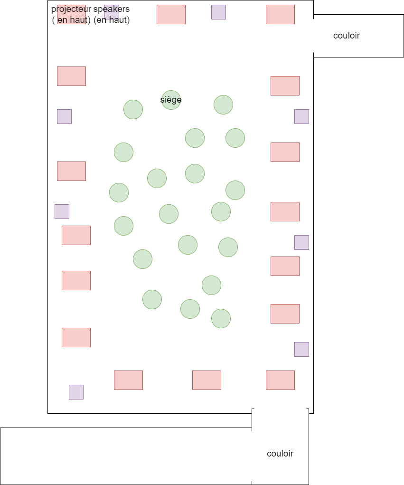

## Titre de l'oeuvre ou de la réalisation
### Énergisation qui contient Horizon, Frozen Music et Journey.

## Nom de l'artiste ou de la firme
### Pour Journey, l'artiste est Nohlab. Pour Frozen Music, les artistes sont Cadie Desbiens-Desmeules et Michael Gary Dean. Pour Horizon, l'artiste est Alex Le Guillou.
## Année de réalisation
### Horizon a été réalisé en 2021. Journey a été présenté en 2019. Frozen Music a été réalisé en 2020.
## Nom de l'exposition ou de l'événement
### énergisation.
## Lieu de mise en exposition
### Oasis immersion dans les galleries du pallais de Montreal.
## Date de votre visite
### Le 12 mars 2022.
## Description de l'oeuvre

### Pour Journey, on est dans une aventure où l'on voit la naissance des photons que l'on représente avec beaucoup de petites particules et des lignes qui font beaucoup de mouvements. Ce voyage montre la transition des photons dans les couches de l'oeil. Ensuite ils vont vers les neurones et font des signaux électriques. En addition, il montre aussi comment on perçoit les photons. toute cette expérience nous paraît comme une aventure avec plein de lignes et de petites particules qui crée des univers très spéciaux et des atmosphères magnifiques. L'ambiance sonore a des bruits très stridents.

###  Pour Frozen Music, on utilise la musique et on la modélise dans un environnement 3D en noir et blanc. Le son est figé dans le temps et le résultat est des formes un peu aléatoire et complexe qui se compare à des infrastructures qui ne font pas de sens. L'ambiance sonore est très chaotique et donne un effet mystérieux à l'oeuvre.

### Pour Horizon, on représente la réalité et notre rêve grace à des images abstraites qui peuvent parfois être en ordre ou chaotique. L'oeuvre est inspirée de la mer et du ciel. L'oeuvre se caractérise par une ligne a l'horizon qui représente l'ordre et qui graduellement se transforme en mer de particule bleu qui représente le chaos. L'ambiance sonore est très calme et nous fait plonger dans le calme pour profiter de l'oeuvre.

## Explications sur la mise en espace de l'oeuvre ou du dispositif 
### L'oeuvre se situe dans une grande pièce avec un couloir pour entrer et un couloir pour sortir. De plus, de nombreux sièges sont disposés autour de la salle et le tout est diffusé sur les 4 murs et le plancher de la salle.

## Liste des composantes et techniques de l'oeuvre ou du dispositif
### Le ficher avec la vidéo de l'oeuvre.
## Liste des éléments nécessaires pour la mise en exposition
###  De nombreux projecteurs sont nécessaires afin de projeter l'oeuvre sur les murs et le sol. Ensuite, des speakers pour le son. De plus, un ordinateur pour faire fonctionner le tout.

## Ce qui m'a plu, qui m'a donné des idées (justifications)
### Pour Horizon, j'ai vraiment aimé l'oeuvre, car la transition entre la ligne et les particules était vraiment bien effectuée et je me sentais absorbé par toutes les particules. Personnellement, je trouve vraiment satisfaisant des groupe de particules ou tout autre petit composant qui bouge fluidement dans des directions aléatoire comme dans l'oeuvre Space Dreams de l'exposition à l'Arsenal Contenporary Art. J'ai aussi aimé l'ambiance sonore, car elle était calme et j' ai remarqué que je suis plus absorbé par les oeuvres qui sont calmes, car ceux-ci donnent une atmosphère où tu peux tout oublier et juste relaxer en regardant l'oeuvre. 

### Pour Journey, j'aime beaucoup l'effet de petites particules qui construisent une image. Je trouve cela originale de créer une image sans utiliser la manière habituelle de remplir les lignes de l'image. De plus, j'aime l'étrangeté de l'oeuvre qui a une signification derrière. Je trouve l'oeuvre bizarre, mais positivement. Par contre, j'aime moins la musique qui était stridente, car elle était irritante à entendre et je me concentrais moins sur l'oeuvre.

### Pour Frozen Music, j'aime beaucoup l'ambiance de noir et blanc, car je trouve que ces couleurs sont les plus belles et elle amène un univers mystérieux. En addition, j'aime les infrastructures que l'oeuvre créait, car ils paraissent comme de vrai infrastructure, mais ne font pas de sens ce qui rend l'oeuvre unique et étrange. Par contre, les bruits étaient stridant ce qui n'est pas mal, mais j'aime mieux des bruits plus calmes, car je peux mieux  me concentrer  sur l'oeuvre.

### En général, j'ai beaucoup aimé le fait que la projection était tout autour de nous et même sur le sol, car cela nous faisait plonger dans l'oeuvre. De plus, J'ai aimé le son qui venait de tous les cotés, ce qui nous plongeaient encore plus dans l'oeuvre.

## Aspect que je ne souhaiterais pas retenir pour mes créations ou que je ferais autrement (justifications)
### la longue durée de l'oeuvre avec toutes les couleurs resplendissantes peut parfois mener à un mot de tête. Je retiens donc qu'une longue exposition dans un univers très grand et resplendissant peut être inconvénient.

## Références

